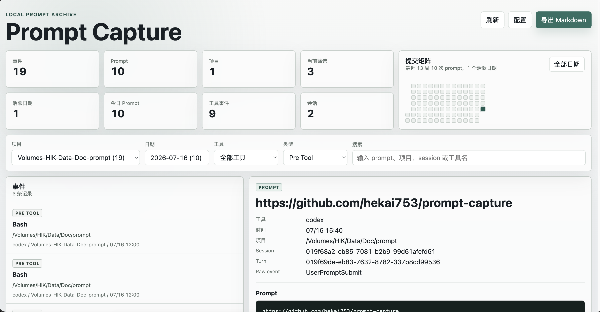

# prompt-capture

Local-first prompt capture for Codex and Claude Code native hooks.

`prompt-capture` records the user-submitted prompt part of AI CLI conversations, stores the data on your machine, generates Markdown archives, and serves a local Web UI for browsing/searching. It does not wrap your terminal session; capture is done through each tool's native hook system.



中文文档: [README.zh-CN.md](./README.zh-CN.md)

## Status

This is an MVP intended for local use and validation with real Codex / Claude Code hook payloads.

Implemented:

- Native hook install/uninstall for Codex and Claude Code.
- Default capture of `UserPromptSubmit` only.
- Optional capture of tool events and stop events.
- Append-only JSONL event log.
- JSON query index for the Web UI.
- Markdown export grouped by project and date.
- Local Web UI with filters, event detail, related events, export, and config editing.
- Raw hook payload storage disabled by default.

Not implemented yet:

- SQLite/FTS index for very large archives.
- Cloud sync.
- Assistant response body capture.
- Wrapper / PTY terminal capture.

## Install

From npm:

```bash
npm install -g prompt-capture
```

From this repository during development:

```bash
pnpm install
npm run build
node dist/src/cli/index.js --help
```

If you want the global command to use this checkout while developing:

```bash
npm link
prompt-capture --help
```

## Quick Start

Preview hook changes first:

```bash
prompt-capture install --target all --scope global --dry-run
```

Install Claude Code hooks:

```bash
prompt-capture install --target claude --scope global
```

Install Codex hooks:

```bash
prompt-capture install --target codex --scope global
```

Start the local Web UI:

```bash
prompt-capture web --port 4873
```

Open:

```text
http://127.0.0.1:4873
```

## Hook Capture Model

The default install captures only submitted user prompts:

```bash
prompt-capture install --target claude --scope global
prompt-capture install --target codex --scope global
```

To include tool call metadata:

```bash
prompt-capture install --target codex --scope global --events prompt,tools
```

To include stop events too:

```bash
prompt-capture install --target codex --scope global --events prompt,tools,stop
```

Supported `--events` values:

```text
prompt              UserPromptSubmit only
prompt,tools        UserPromptSubmit + PreToolUse + PostToolUse
prompt,tools,stop   UserPromptSubmit + PreToolUse + PostToolUse + Stop
all                 all supported hook events
```

The installer appends hook entries, marks entries with `--installed-by prompt-capture`, and creates timestamped backups before writing config files. `uninstall` removes only hook entries owned by this tool.

```bash
prompt-capture uninstall --target all --scope global
```

## Codex Notes

Codex also requires user-level hook support:

```toml
[features]
hooks = true
```

Project-scoped Codex hooks require the project to be trusted by Codex. The installer writes hook manifests but does not forge Codex hook trust state.

## Commands

```bash
prompt-capture install --target claude|codex|all [--scope global|project] [--events prompt|prompt,tools|prompt,tools,stop|all] [--dry-run]
prompt-capture uninstall --target claude|codex|all [--scope global|project] [--dry-run]
prompt-capture ingest --source claude-code|codex [--home path] [--print-id]
prompt-capture export-md [--home path]
prompt-capture web [--home path] [--port 4873] [--background]
prompt-capture web status|stop [--home path]
prompt-capture config get [--home path]
prompt-capture config set rawPayloads true|false [--home path]
prompt-capture config set markdownMode realtime|manual [--home path]
```

Hook ingestion is silent by default so Codex and Claude Code do not try to parse diagnostic stdout. For manual debugging:

```bash
prompt-capture ingest --source codex --print-id < payload.json
```

## Web UI

The Web UI is local-only and binds to `127.0.0.1`.

```bash
prompt-capture web --port 4873
```

Run it as a background process:

```bash
prompt-capture web --port 4873 --background
prompt-capture web status
prompt-capture web stop
```

Background mode writes `web-server.json` and `web-server.log` under the storage root. Status shows the URL, PID, and storage root in use.

Chrome can install the Web UI as a standalone app from the address bar install button or the "Install Prompt Capture" menu item. This uses the local PWA manifest and service worker; the app still talks only to the local `127.0.0.1` service.

Current Web UI features:

- Dashboard counts for events, prompts, projects, active days, today's prompts, tool events, sessions, and current filters.
- Prompt activity matrix for the last 13 weeks. Clicking an active day filters the event list.
- Filter by project, date, source tool, event type, and keyword.
- Date picker disables days that do not contain submitted prompts.
- Event list with prompt snippets and source metadata.
- Detail view with full prompt, metadata, tool summaries, and related session/turn events.
- Inline Markdown export status.
- Config dialog for `rawPayloads` and `markdownMode`.
- Read-only display of storage, Markdown, and config paths.

## Config

View config:

```bash
prompt-capture config get
```

Default config:

```json
{
  "rawPayloads": false,
  "markdownMode": "realtime"
}
```

Enable raw payload storage only when debugging adapter payloads:

```bash
prompt-capture config set rawPayloads true
```

Switch Markdown generation to manual export only:

```bash
prompt-capture config set markdownMode manual
```

Switch it back to per-ingest refresh:

```bash
prompt-capture config set markdownMode realtime
```

## Storage

Default storage root:

```text
~/.prompt-capture/
```

Override it for a command:

```bash
PROMPT_CAPTURE_HOME=/path/to/archive prompt-capture web
```

Or with `--home`:

```bash
prompt-capture web --home /path/to/archive --port 4873
prompt-capture web --home /path/to/archive status
```

Current layout:

```text
~/.prompt-capture/
  config.json
  events/
    YYYY-MM-DD.jsonl
  index.json
  md/
    projects/<project-slug>/YYYY-MM-DD.md
  raw/
    <source>/YYYY-MM-DD/<event-id>.json
```

Notes:

- `events/*.jsonl` is the durable append-only event log.
- `index.json` is the MVP query index used by the Web UI.
- `md/` is a derived readable projection and can be regenerated.
- `raw/` is written only when `rawPayloads` is enabled.

## Markdown Export

Generate or regenerate Markdown files:

```bash
prompt-capture export-md
```

Markdown files are written under:

```text
~/.prompt-capture/md/projects/<project-slug>/YYYY-MM-DD.md
```

When `markdownMode` is `realtime`, ingestion refreshes only the current project/date Markdown file. Full regeneration still uses `export-md`.

## Privacy

- Data stays local by default.
- The default storage directory is under the user home directory, not the captured project.
- Raw hook payloads are off by default.
- Assistant response bodies are not captured in the MVP.
- Be careful before committing generated archives; prompts can contain secrets or proprietary context.

## Development

Install dependencies and build:

```bash
pnpm install
npm run build
```

Run validation:

```bash
npm run typecheck
npm test
npm run build
```

Manual local validation with a fixture payload:

```bash
node dist/src/cli/index.js ingest --source claude-code --home /tmp/prompt-capture-dev < tests/fixtures/claude-user-prompt.json
node dist/src/cli/index.js export-md --home /tmp/prompt-capture-dev
node dist/src/cli/index.js web --home /tmp/prompt-capture-dev --port 4873
```

Package locally:

```bash
npm pack
```
